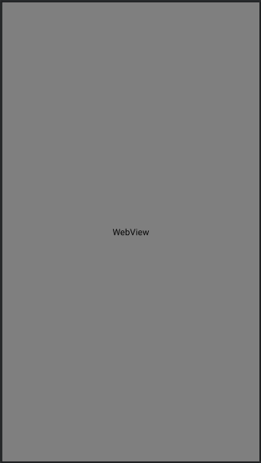
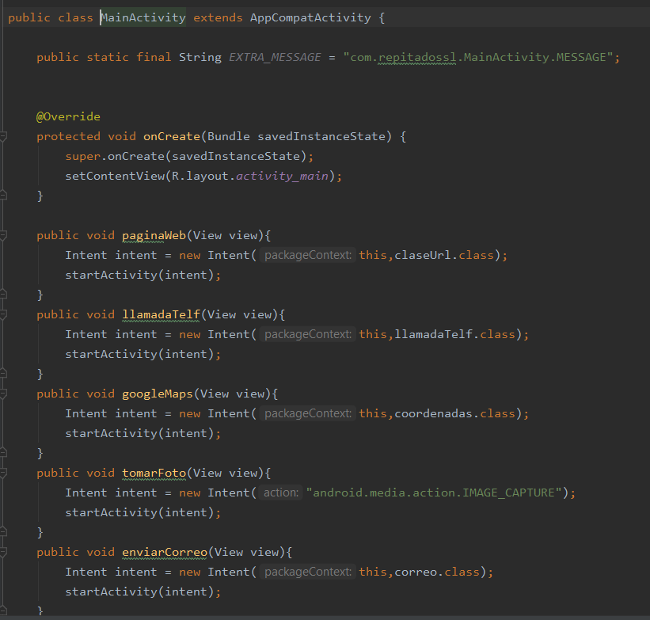
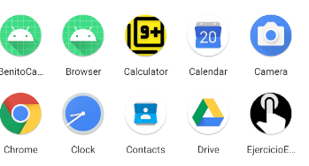

# EjercicioEvaluableDavidParejo

Este repositorio contiene una aplicación con diferentes botones que realizan diferentes acciones en android.

<h2>1º El diseño de la actividad principal🐱‍🏍✨</h2>

El diseño de la actividad se divide en diferentes fases en la primera que es la actividad que se ejecuta  
  
  
la segunda parte que es la actividad que se ejecuta cuando se pulsa el boton de abrir pagina web 
  
  

la tercera parte que es la actividad que se ejecuta cuando se pulsa el boton de llamar por telefono 
  
  

la cuarta parte que es la actividad que se ejecuta cuando se pulsa el boton de google maps 
  
  

la sexta parte que es la actividad que se ejecuta cuando se pulsa el boton de mandar correo 
  
  

El diseño y vista del webView 
  
  

<h2>2º El codigo de la aplicación🐱‍🏍✨</h2>

El codigo de la aplicación tambien se divide en diferentes fases:

 <h3>1ª Fase: 🥇🥈🥉</h3> 

 En la actividad que se ejecuta lo unico que hay que hacer es crear los metodo que se pondran en los onClick de los botones cada uno de ellos ejecuta una actividad diferente. 
  

 En la clase que se abre al pulsar el botonde pagina web lo unico que hay que cojer el id de los editText para pasarselos a una nueva pagina al pulsar el boton. 
   
 
 En la actividad que se abre lo unico que hay que hacer es poner un webView al que se le pasa una url, también e controlado la url por sin no pone https para que tambien pueda buscar. 
   
 
    
 La actividad que se abre al pulsar el botón de llamar coge el texto del editText con su correspondiente id y se lo pasa a un intent para que se le pase ese numero para poder llamar, en esta clase se tienen que tocar los permisos para poder llamar 
   
   

 Para mandar un correo utilizamos los editText y lo pasamos a una nueva actividad en la que sale una ventana para mandar un correo. 
   

  Para las coordenadas se hace lo mismo que en el caso anterior pero con la diferencia de que el contenido de eso editText se le pasan al maps en vez del gmail. 
   

 en cada boton y en cada textView se ha utilizado string diferentes y para los botones onClick
    
    

<h2>Añadido🐱‍🏍✨<h2>

Lo siguiente no influye en el funcionamiento de la calculadora pero sirve para que se vea mejor.

<h3>Icono de la aplicación 🥇🥈🥉</h3>

El icono utilizado es el siguiente 
  
  

En la bibliografia se encuentra el enlace al video tutorial.

<h3>Boton para volver al inicio🥇🥈🥉</h3>

El boton se consigue con el siguiente codigo. 
  
  
y el resultado es el siguiente. 
  

<h2>Funcionamiento de la aplicación🐱‍🏍✨<h2>

  

<h2>Bibliografia🐱‍🏍✨<h2>
-Video para el icono 
https://www.youtube.com/watch?v=OACRVxwWYrM&ab_channel=Rackcode.info 
-Pagina para crear el icono 
https://romannurik.github.io/AndroidAssetStudio/icons-launcher.html#foreground.type=clipart&foreground.clipart=android&foreground.space.trim=1&foreground.space.pad=0.25&foreColor=rgba(96%2C%20125%2C%20139%2C%200)&backColor=rgb(68%2C%20138%2C%20255)&crop=0&backgroundShape=square&effects=none&name=ic_launcher

<h2>Autor🐱‍🏍✨<h2>
<h4>David Parejo Aliaga 1ºDAW</h4>
